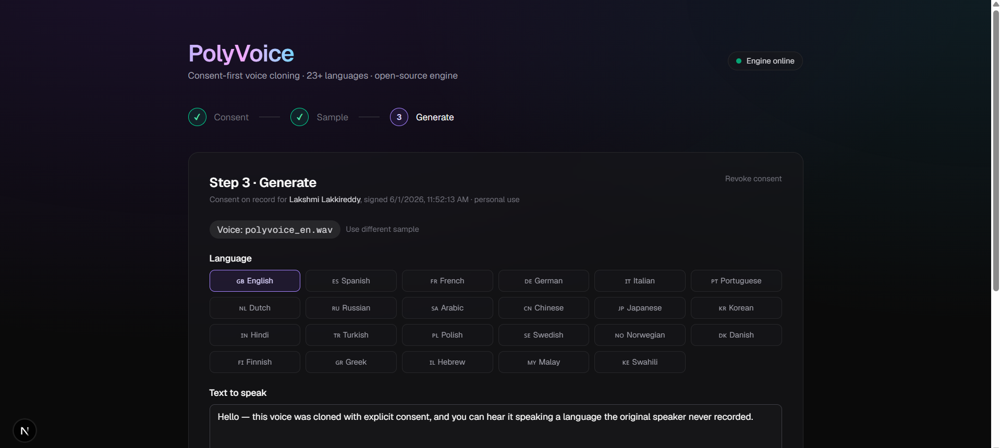

# PolyVoice

**Consent-first, multilingual voice-cloning studio.** Upload 10–30 seconds of a speaker's voice (with their signed consent), and synthesize speech in 23+ languages — in that same voice. Built on the open-source [Chatterbox-TTS](https://github.com/resemble-ai/chatterbox) engine.

## Demo

One English reference sample → the **same voice speaking five languages**, generated on a GPU in ~4 seconds each:

| Language | Sample |
| --- | --- |
| 🇬🇧 English | [`polyvoice_en.wav`](kaggle_kernel/audio/polyvoice_en.wav) |
| 🇪🇸 Spanish | [`polyvoice_es.wav`](kaggle_kernel/audio/polyvoice_es.wav) |
| 🇫🇷 French | [`polyvoice_fr.wav`](kaggle_kernel/audio/polyvoice_fr.wav) |
| 🇮🇳 Hindi | [`polyvoice_hi.wav`](kaggle_kernel/audio/polyvoice_hi.wav) |
| 🇯🇵 Japanese | [`polyvoice_ja.wav`](kaggle_kernel/audio/polyvoice_ja.wav) |

<!-- TODO: add a UI screenshot at docs/screenshot.png and uncomment:

-->

## Why this exists

Voice cloning is now production-quality and free. The hard part isn't the model — it's:

1. **Consent.** Voice is biometric data. Cloning without consent is illegal in the EU (GDPR), California (AB 730), and Tennessee (ELVIS Act, 2024). Most demos skip this.
2. **Cross-lingual transfer.** A speaker who only recorded English can now "speak" Spanish, Hindi, Japanese — useful for content localization, accessibility, and language learning.
3. **A product layer.** The bare model is a Python API. PolyVoice is the UI/UX, audit trail, and workflow on top.

## Architecture

```
Browser (Next.js 16 + React 19 + Tailwind v4)
   │
   │  fetch /api/{upload, tts, status, ...}
   ▼
Next.js Route Handlers  ←  serves as proxy + auth boundary
   │
   │  HTTP → http://localhost:8004
   ▼
Chatterbox-TTS FastAPI server  ←  ResembleAI/chatterbox multilingual model
   │
   ▼
PyTorch on CPU/GPU
```

The Next.js layer owns the consent flow and product UX; the Python server owns inference. They are completely decoupled — swap Chatterbox for OpenVoice v2 or F5-TTS by editing one file (`lib/chatterbox.ts`) and one route (`app/api/tts/route.ts`).

## Features

- **Three-step flow.** Sign consent → upload sample → generate.
- **Digital consent record** persisted to `localStorage`, with revocation.
- **23+ languages** (English, Spanish, French, German, Hindi, Mandarin, Japanese, Arabic, …).
- **ElevenLabs-style voice settings.** Tune expressiveness, stability, temperature, and speed, with Natural / Expressive / Stable presets.
- **Real-time engine status** (heartbeat every 5s).
- **In-browser audio history** with WAV download.

## Run the engine on Colab GPU (recommended)

The TTS model needs 3–4 GB of RAM and is slow on CPU. The easiest path is to run it
on a free Colab GPU and expose it on a public URL — your laptop stays idle.

1. Upload [`colab/PolyVoice_Engine_GPU.ipynb`](colab/PolyVoice_Engine_GPU.ipynb) to
   [Google Colab](https://colab.research.google.com/).
2. **Runtime → Change runtime type → T4 GPU**.
3. Run all cells. The last cell prints a public `https://….trycloudflare.com` URL.
4. Either:
   - **Zero local:** open that URL — Chatterbox's own UI runs entirely on the GPU, or
   - **PolyVoice:** put it in `polyvoice/.env.local` and start the frontend:
     ```
     CHATTERBOX_URL=https://your-tunnel.trycloudflare.com
     ```

Because PolyVoice's API routes are server-side proxies, there are no CORS issues —
the only local process is the lightweight Next.js dev server (~0.5 GB).

## Run the engine locally (needs 4 GB+ free RAM, GPU strongly preferred)

```powershell
cd Chatterbox-TTS-Server-windows-easyInstallation
.\venv310\Scripts\python.exe server.py
```

First run downloads ~3 GB of model weights from Hugging Face. Subsequent runs are cached.

> **Windows notes (learned the hard way):**
> - Use the **`venv310`** environment, *not* `venv` — only `venv310` has the `chatterbox` package installed.
> - Make sure `hf_transfer` is installed in it (`.\venv310\Scripts\python.exe -m pip install hf_transfer`), or the model fails to load on startup.
> - In `.env.local`, point at **`http://127.0.0.1:8004`**, *not* `http://localhost:8004` — Node's `fetch` resolves `localhost` to IPv6 (`::1`) while the engine binds IPv4, which silently times out.

## Start the Next.js app

```powershell
cd polyvoice
npm install        # only on first run
npm run dev
```

Open <http://localhost:3000>. Set `CHATTERBOX_URL` in `.env.local` to point at either
the local engine (`http://localhost:8004`) or your Colab tunnel URL.

## Tech stack

| Layer       | Choice                                  | Why                                       |
| ----------- | --------------------------------------- | ----------------------------------------- |
| Frontend    | Next.js 16 (App Router) + React 19      | Server-side proxy + modern React          |
| Styling     | Tailwind CSS v4                         | Zero-config, design-token driven          |
| TTS engine  | Chatterbox-TTS (`ResembleAI/chatterbox`) | MIT-aligned, multilingual, voice cloning  |
| Audio       | WAV streamed via Web Audio              | `<audio>` element, blob URLs              |
| Persistence | `localStorage` (consent + state)        | No backend DB needed for v1               |

## Roadmap

- Inaudible watermark on generated audio for traceability
- Server-side consent ledger (Postgres) with revocation API
- Audiobook mode: upload PDF → auto-chunked audio output
- Streaming TTS over WebSocket for sub-second TTFB
- Hosted demo on Hugging Face Spaces with rate-limiting

## Legal note

PolyVoice is for **educational and authorized use only**. You are responsible for obtaining lawful consent from any speaker whose voice you clone. Do not use this software to impersonate, defraud, or harass.

## License

MIT — see `LICENSE`. The Chatterbox model has its own license; review it before commercial use.
